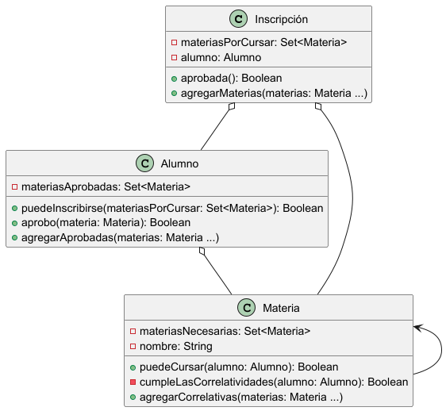

# Validador de Correlativas

## Objetivo
Realizar un [validador de correlativas](Enunciado.pdf) basado en el sistema utilizado en nuestra universidad.

## Dominio
Se consideran solamente las correlativas por aprobación, reduciendo el scope del problema.

## Diagrama de clases

## Diseño
Se busca maximizar el encapsulamiento y delegación de responsabilidades haciendo un programa fuertemente orientado en el **POO**.
El flujo de mensajes para saber si una inscripción está aprobada es el siguiente:

> inscripción.aprobada() ->
>
>alumno.puedeInscribirse(materiasPorCursar) -> 
>
>∀ materiaPorCursar: materia.puedeCursar(alumno) -> 
>
>materia.cumpleCorrelatividades(alumno) -> 
>
>∀ materiaNecesaria: alumno.aprobo(materia) -> 
>
>materiasAprobadas.contains(materia)

## Herramientas
- Oracle OpenJDK 17.0.12
- Maven
  - JUnit5
  - ProjectLombok
- PlantUML

## Tests unitarios
- InscripcionTest
  - InscripcionAprobada
  - InscripcionRechazada
- AlumnoTest
  - AgregarAprobadas
  - materiaAprobada
- MateriaTest
  - AgregarCorrelativas

## Observaciones
- Fue interesante aprender sobre el método de colecciones `allMatch()`
- La equivalencia `objeto.método(parámetro) === objeto::método` fue confusa en un principio